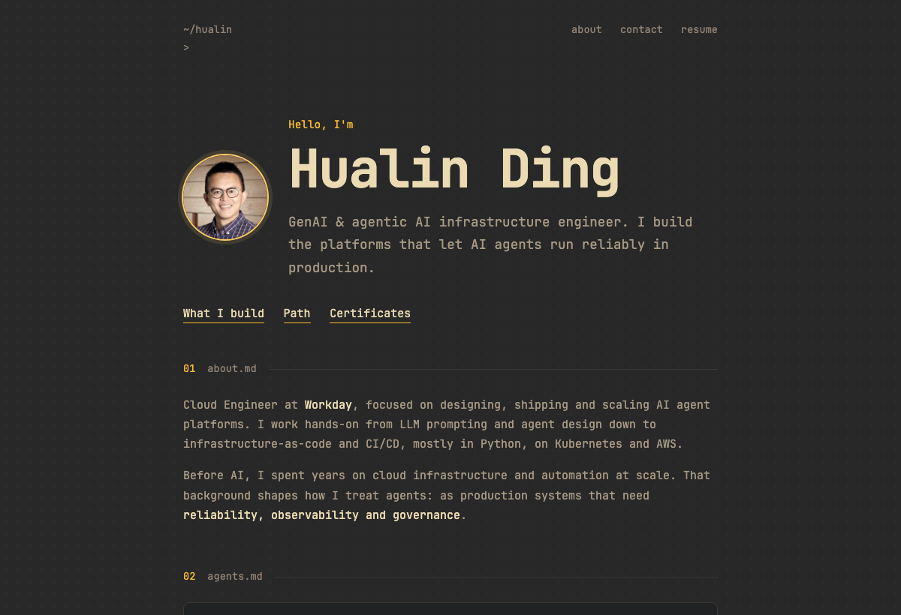

<div align="center">

```
~/hualin
> █
```

# Hualin Ding · portfolio

**GenAI & agentic AI infrastructure engineer.**
A terminal-flavored personal site, built to feel like the platforms I build: fast, observable, a little playful.

[](https://hualin-ding.github.io/)
[](https://astro.build)
[](https://github.com/Hualin-Ding/Hualin-Ding.github.io/actions)
[](https://github.com/Hualin-Ding/Hualin-Ding.github.io/releases)



</div>

&nbsp;

## `about.md`

One static page, no UI framework, no tracking. Gruvbox colors lifted from my terminal config, JetBrains Mono everywhere, and a few small details that say what I work on.

## `features.md`

- **Streaming hero**: the intro types itself in a few characters at a time, like an LLM reply, with a cursor that follows the newest text.
- **Living background**: a dot grid that leaves a glowing trail behind the mouse; when the mouse rests, the trail ignites into fireflies. Dots clear away over text so reading stays easy. Click blank space to re-ignite.
- **Agent trace card**: a looping mock agent run (Q&A, drift detection, knowledge base, agent hosting) with generic, invented content, playing only while on screen.
- **Hover details**: each role on the timeline opens a panel of highlights on hover or keyboard focus, and tap-to-expand on touch screens.
- **Collapsible stack**: the AI tooling is always visible; cloud, delivery, ops and dev tooling expand on click.
- **Print-ready résumé**: the *resume* link opens the print dialog, and a dedicated print stylesheet turns the page into a two-page résumé. It is generated from the live content every time, so it can never go stale.
- **Spam-resistant contact**: the email address is never in the page source. It is stored encoded and assembled only after a real click, or while printing.
- **Accessible by default**: semantic HTML, keyboard focus states, and `prefers-reduced-motion` turns the animations off.

## `stack.yaml`

```yaml
framework: Astro            # static output, zero client framework
language:  HTML + CSS + a little TypeScript
styling:   plain CSS, Gruvbox palette, self-hosted JetBrains Mono (@fontsource)
effects:   canvas 2D (dot field), IntersectionObserver (trace card)
seo:       @astrojs/sitemap, robots.txt, Open Graph tags
hosting:   GitHub Pages
ci_cd:     GitHub Actions (build + deploy on every push to main)
```

## `develop.sh`

```sh
npm install        # Node >= 22.12
npm run dev        # http://localhost:4321
npm run build      # static site -> dist/
npm run preview    # serve the production build locally
```

> The repo's `.npmrc` points npm at the public registry, so installs work even if your global registry is private.

## `structure.txt`

```text
.
├── .github/workflows/deploy.yml   # build + deploy to GitHub Pages
├── public/                        # served as-is: profile photo, robots.txt, favicons
├── src/
│   ├── layouts/Layout.astro       # <head>, global styles, print stylesheet
│   ├── pages/index.astro          # all page content
│   └── components/
│       ├── DotField.astro         # background canvas: trail, fireflies, ignition
│       ├── StreamText.astro       # streaming hero text + cursor
│       └── AgentTrace.astro       # looping mock agent run
├── docs/screenshot-home.png
└── astro.config.mjs               # site URL + sitemap
```

## `deploy.log`

```text
git push origin main
  └─ GitHub Actions
       ├─ npm ci
       ├─ npm run build          →  dist/
       ├─ upload Pages artifact
       └─ deploy                 →  https://hualin-ding.github.io
```

A failed build deploys nothing, so the live site always stays on the last good version.

## `notes.md`

- **Edit content** in `src/pages/index.astro`: sections, experience bullets and the tool lists are plain markup.
- **Tune the effects** at the top of each component script: `REST` (pause before fireflies), `IGN` (ignition time), `R` (glow radius) in `DotField.astro`; the delays in `StreamText.astro`.
- **Print layout** lives in the `@media print` block of `Layout.astro`. In the browser's print dialog, turn off *Headers and footers* and leave *Background graphics* on.
- **Privacy**: no analytics, no cookies, no third-party requests at runtime. The only external references are the README badges.

&nbsp;

<div align="center">

`© 2026 Hualin Ding`

</div>
